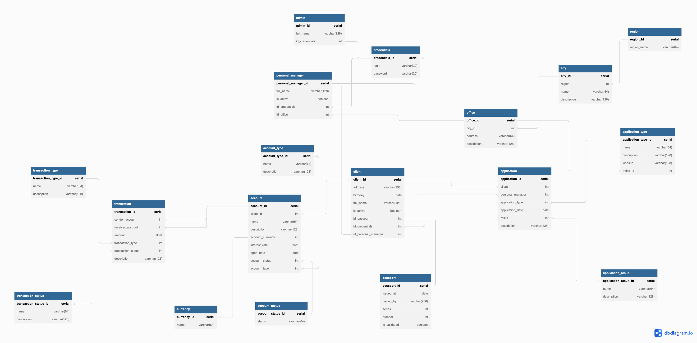
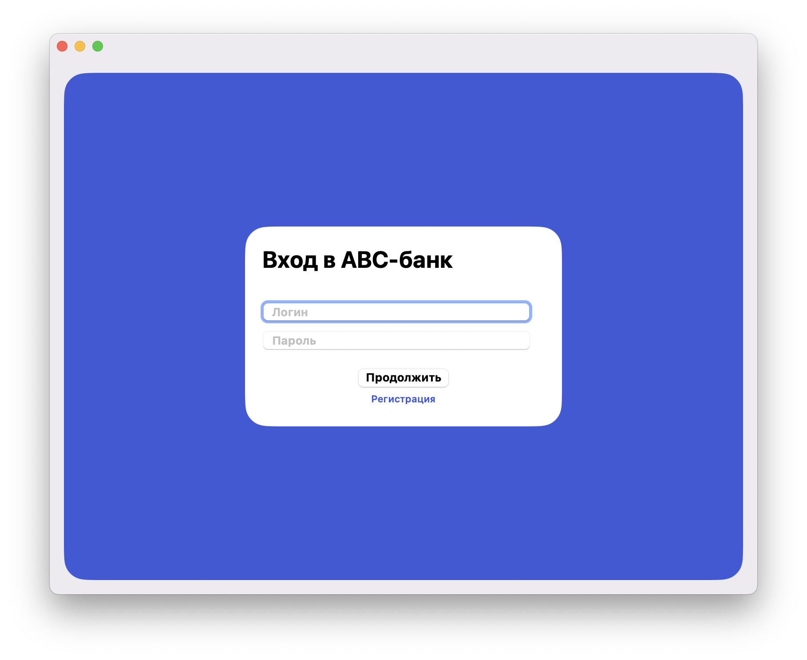
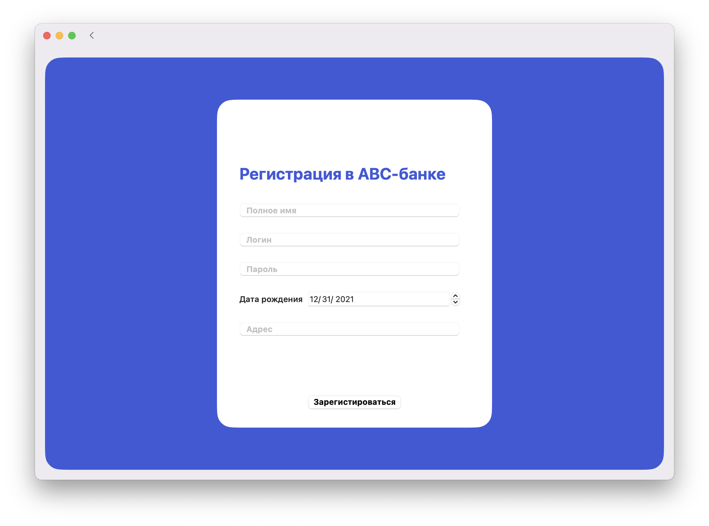
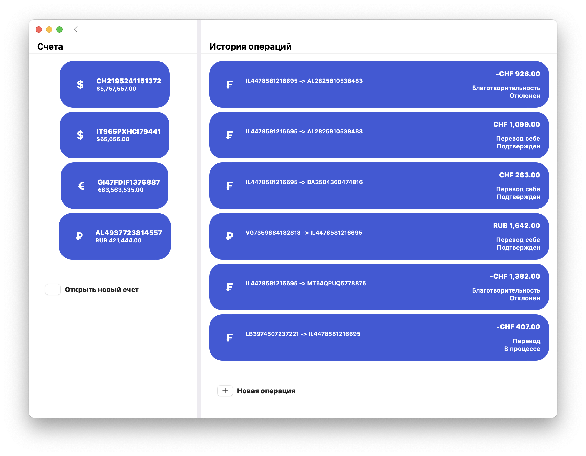
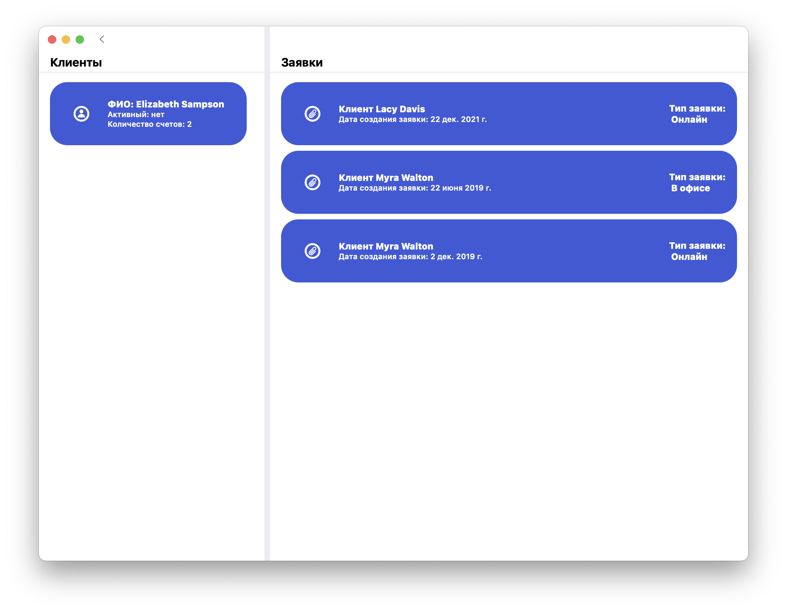
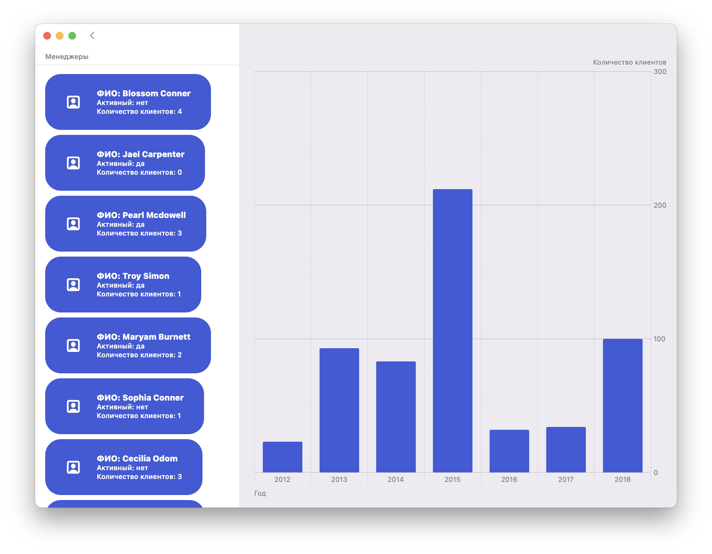

# Автоматизированная система управления сберегательным банком

## Описание

Необходимо реализовать системы для автоматизации работы сберегательного банка. 
В системе должно быть 3 типа пользователей: клиент, менеджер и администратор.
Система должна хранить информацию о клиентах и менеджерах, счетах, доступном остатке на них, а также условиях, на которых этот счет открыт (процентная ставка, валюта, тип счета).
- Клиент может просматривать информацию о себе, своих счетах, а также переводить деньги между счетами (в том числе другим клиентам).
- Менеджер в свою очередь, может регистрировать новых клиентов, обрабатывать поступающие заявки, редактировать информацию о клиентах.
- Роль администратора, в свою очередь, позволяет создавать аккаунты менеджеров, редактировать их и смотреть их статистику.

## Инструменты и технологии

### Схема базы данных

### Стек приложения 
- Swift
- SwiftUI
- PostgreSQL

## Скриншоты

### Страница входа

### Страница регистрации

### Личный кабинет клиента

### Личный кабинет менеджера

### Личный кабинет администратора

